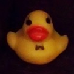

#+setupfile: posts/setup.org
#+toc: nil

* Hello

I am Igor Zhirkov, between Nantes and Warsaw.

[[https://rubber-duck-typing.com/files/cv.pdf][My CV]]

I live by the code: to be and not to seem.

I like philosophy, maths, programming, programming languages theory, and
designing systems. I approach everything through language, engineering and
systems.

I have written a [[https://amazon.com/Low-Level-Programming-Assembly-Execution-Architecture/dp/1484224027][book]] about low-level programming for my students; this is a
slightly outdated version of the class I was teaching in ITMO university in St.
Petersburg, Russia. I've spent almost 14 years teaching; I don't do it anymore,
but you can still check my online course on C hosted on [[https://stepik.org/course/73618][Stepik]] (in Russian).

I am an amateur pianist. My preferences are baroque and late-romantic music,
progressive rock, jazz fusion, and various types of electronic music. Bach is my
favorite form of meditation -- we all could use some of his mental health.

I exist best underwater, I have certification for AOWD.

Feel free to drop me a line by [[mailto:igorjirkov@gmail.com][mail]] or in [[https://t.me/igorjirkov][telegram]].
I speak English, French, German, Russian, and basic Polish.

[[https://paypal.me/igorzhirkov][paypal me]]

Mr. Duck (Мистер Утка) is a snobbish, intellectual, and slightly misanthropic
gentleman with an original world view. He is not my alter ego.

#+export_html: 

#+export_html: 

